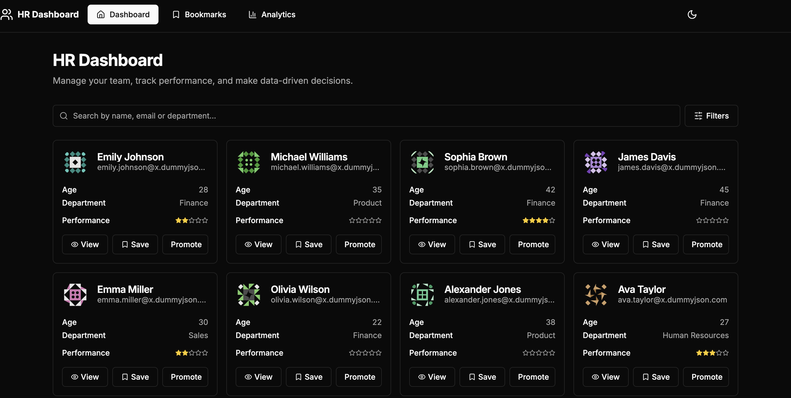
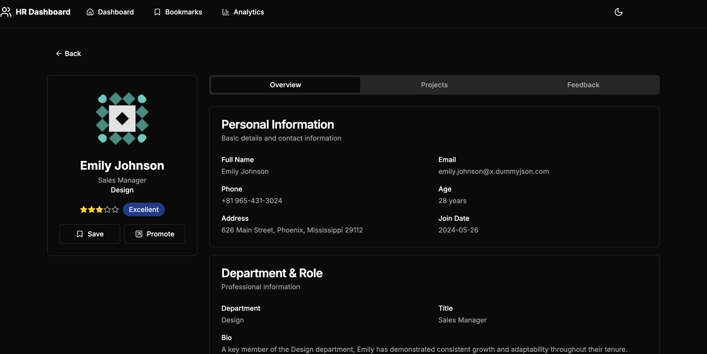
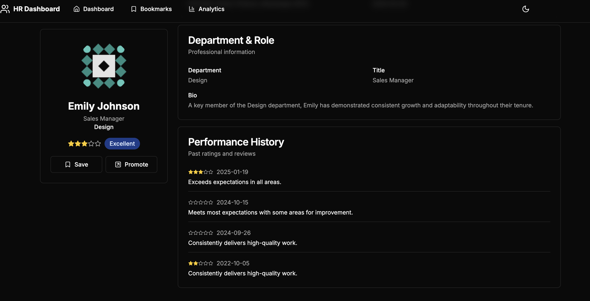
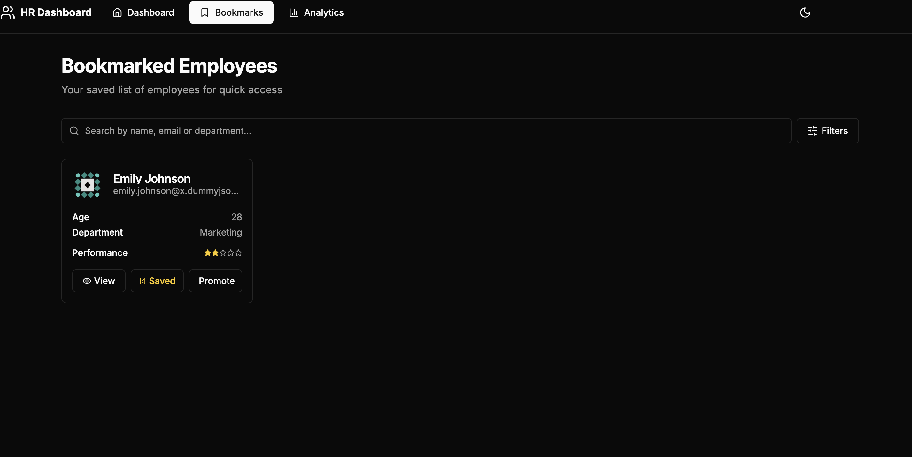
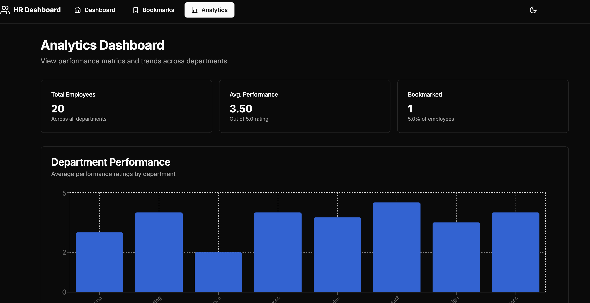
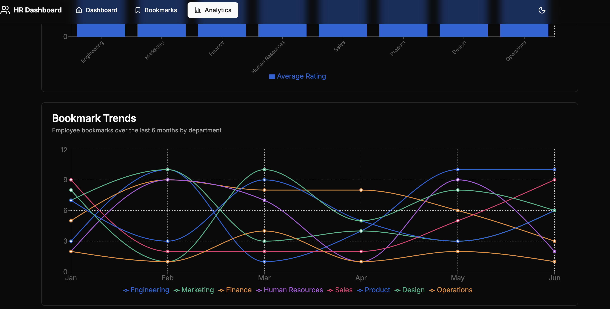

# ⚙️ HR Performance Dashboard (Advanced)

A sleek, responsive, and feature-rich **HR Dashboard** built using **Next.js (App Router)**, **Tailwind CSS**, and **JavaScript (ES6+)**. This mini-dashboard helps HR Managers visualize employee performance, manage bookmarks, and access rich analytics — all with a modern UI and modular architecture.

---

## 🔧 Tech Stack

- **Frontend Framework:** React (Next.js App Router)
- **Styling:** Tailwind CSS
- **JavaScript:** ES6+
- **State Management:** Context API / Zustand
- **Data Visualization:** Chart.js
- **Authentication (Bonus):** NextAuth.js *(optional)*
- **Animation (Bonus):** Framer Motion *(optional)*

---

## 🧩 Features

### 🏠 Dashboard Homepage (`/`)

- Fetches data from `https://dummyjson.com/users?limit=20`
- User cards showing:
  - Full Name, Email, Age, Department (mocked)
  - Performance rating (1–5 stars)
  - Action buttons: `View`, `Bookmark`, `Promote`

### 🔍 Search & Filter

- Search users by **name, email, or department**
- Multi-select filter by **department** or **performance rating**

### 👤 Employee Details Page (`/employee/[id]`)

- Shows:
  - Address, Phone, Bio, Past performance history (mocked)
  - Tabbed UI:
    - `Overview`, `Projects`, `Feedback`
- Dynamic tab loading
- Styled badges and performance stars

### 📌 Bookmark Manager (`/bookmarks`)

- List of all bookmarked users
- Remove bookmarks
- UI actions: `Promote`, `Assign to Project`

### 📊 Analytics Page (`/analytics`)

- Department-wise average performance (Chart.js)
- Bookmark trends (mocked data)
- Optional: SSR/SSG for optimized performance

---

## ✨ Bonus Features

- ✅ **Dark/Light Mode** using Tailwind’s `dark:` classes
- ✅ **Custom Hooks** like `useBookmarks`, `useSearch`
- ✅ **Reusable Components** – Button, Card, Badge, Modal
- ✅ **Responsive Design** – Mobile to Desktop
- ✅ **Accessibility** – Keyboard navigable UI
- ✅ **Form Handling** (Feedback submission)
- ✅ **Authentication** (via NextAuth.js) *(optional)*
- ✅ **Create User** modal/page with validation *(bonus)*
- ✅ **Pagination / Infinite Scroll** *(bonus)*
- ✅ **Animated Tab Transitions** *(Framer Motion)* *(bonus)*

---

## 📁 Folder Structure

```
/
├── app/
│   ├── page.tsx                # Homepage
│   ├── employee/[id]/page.tsx  # Dynamic user details
│   ├── bookmarks/page.tsx      # Bookmarks
│   ├── analytics/page.tsx      # Analytics
│   └── ...
├── components/                 # Reusable UI components
│   ├── Card.tsx
│   ├── Button.tsx
│   ├── Modal.tsx
│   ├── RatingStars.tsx
│   └── ...
├── hooks/                      # Custom hooks
│   ├── useBookmarks.ts
│   ├── useSearch.ts
│   └── ...
├── lib/                        # Utilities and mock data
├── public/                     # Static files & model assets
├── styles/                     # Global styles
└── README.md
```

---

## 📦 Getting Started

### 🛠️ Prerequisites

- Node.js (v18+)
- npm or yarn

### ⚙️ Installation

```bash
# Clone the repo
git clone https://github.com/your-username/hr-dashboard.git
cd hr-dashboard

# Install dependencies
npm install

# Run the development server
npm run dev
```

Visit `http://localhost:3000` to view the app.

---

## 🖼️ Screenshots

### 🏠 Dashboard Homepage


### 👤 Employee Details



### 👤 Book Marks


### 📊 Analytics




## 🙌 Acknowledgments

- [dummyjson.com](https://dummyjson.com/) for mock API
- [randomuser.me](https://randomuser.me/) for realistic profile data
- [Chart.js](https://www.chartjs.org/) for data visualization
